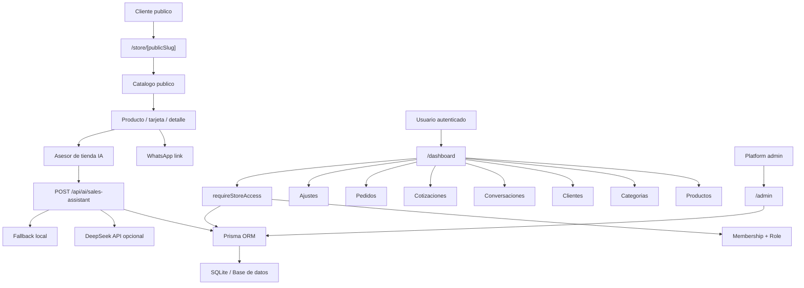
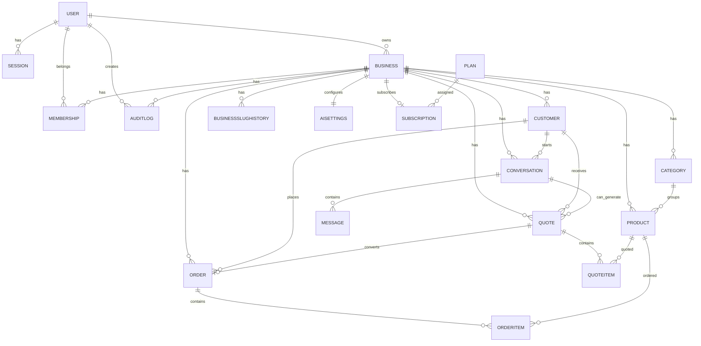
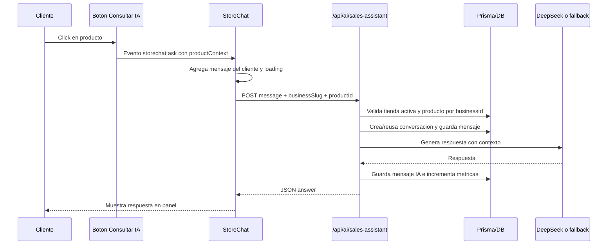
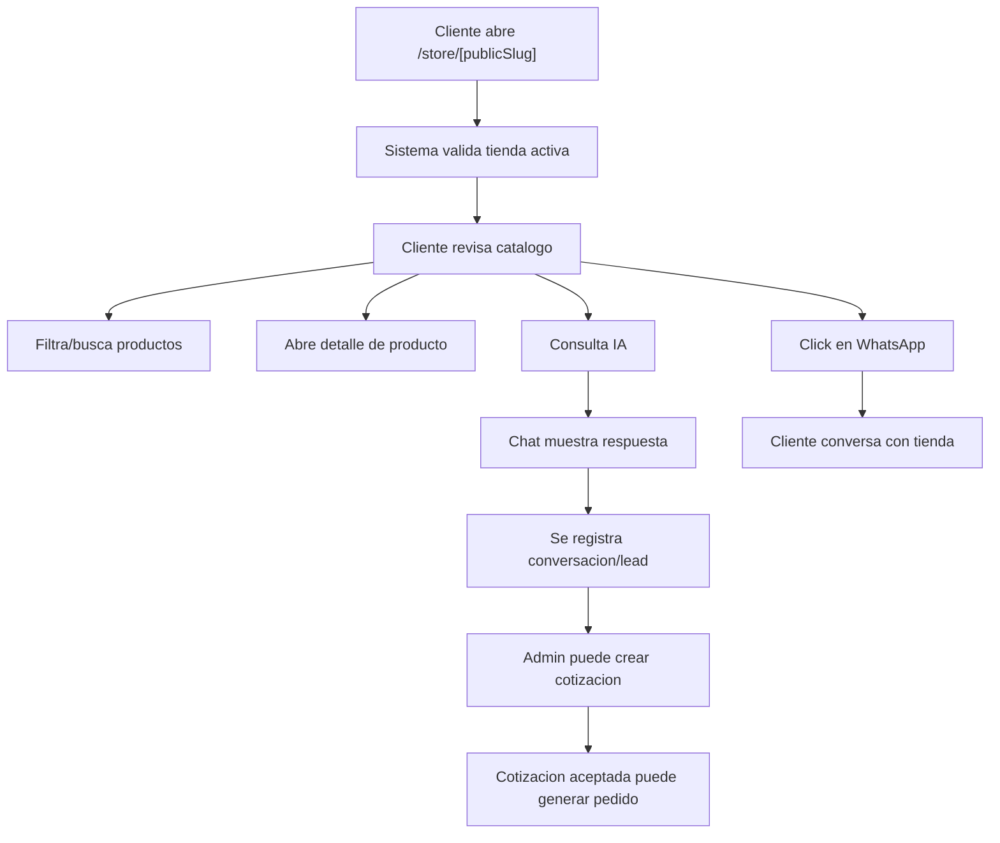
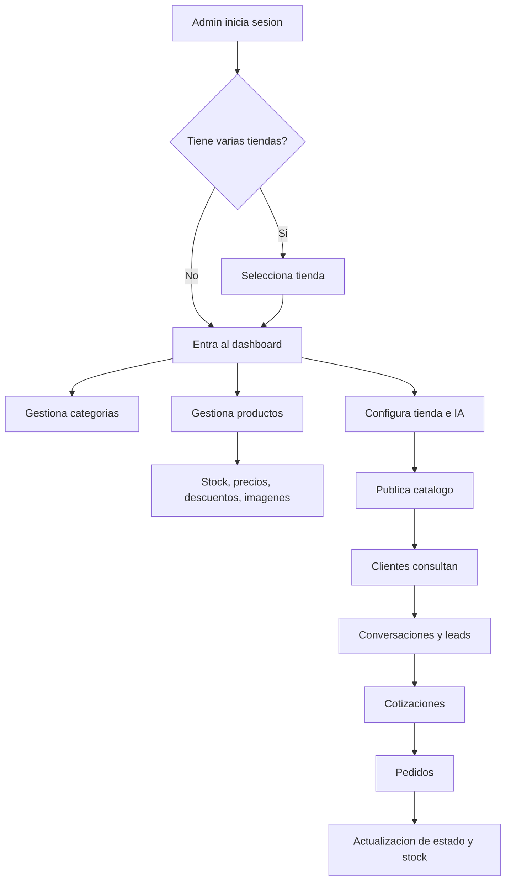

# Documentación Completa del SaaS CATG Omniventas

## 1. Resumen ejecutivo

CATG Omniventas es un SaaS multi-tienda para crear y administrar catálogos comerciales públicos con productos, stock, descuentos, imágenes, contacto por WhatsApp y un asesor de tienda con IA.

El sistema permite que cada negocio tenga su propia tienda pública bajo una ruta como `/store/storelamon`, administre productos desde un panel privado, atienda consultas de clientes, genere cotizaciones y convierta cotizaciones aceptadas en pedidos.

La propuesta de valor principal es entregar a tiendas pequeñas, emprendimientos y negocios locales un catálogo digital rápido de publicar, conectado a WhatsApp y reforzado por IA para responder preguntas sobre productos, precios, disponibilidad y recomendaciones.

El proyecto ya contiene una base técnica relevante para SaaS comercial: separación por tienda mediante `Business`, membresías, roles, planes, catálogo público, panel dashboard, rutas API, Server Actions, Prisma, validaciones con Zod, rate limiting, logs de auditoría, control de slugs públicos y fallback local para IA.

También existen áreas que todavía requieren endurecimiento antes de venderlo como producto robusto: pagos reales, onboarding comercial completo, gestión avanzada de usuarios por tienda, pruebas automatizadas más amplias, almacenamiento externo de imágenes, observabilidad, backups, verificación de email y más controles de producción.

## 2. Objetivo del software

El objetivo principal del sistema es permitir que un negocio cree una tienda/catálogo público sin desarrollar una tienda online completa desde cero.

El software sirve para clientes que necesitan:

- Publicar productos con fotos, precios, descuentos y stock.
- Compartir un catálogo por enlace.
- Recibir consultas por WhatsApp.
- Usar un asesor de tienda con IA para orientar al comprador.
- Gestionar clientes, conversaciones, cotizaciones y pedidos desde un panel.
- Operar varias tiendas dentro de una misma plataforma SaaS.

El enfoque actual parece orientado a una primera versión comercial para catálogos asistidos por IA y venta consultiva, no a un ecommerce transaccional completo con carrito, checkout y pasarela de pago integrada.

## 3. Problema que resuelve

Muchas tiendas pequeñas venden por WhatsApp, Instagram o presencialmente, pero no tienen un catálogo ordenado ni un flujo claro para atender preguntas repetidas.

Este SaaS resuelve problemas como:

- Productos desordenados en chats o redes sociales.
- Falta de catálogo público fácil de compartir.
- Consultas repetidas sobre precio, stock, características y disponibilidad.
- Dificultad para convertir conversaciones en cotizaciones o pedidos.
- Falta de trazabilidad sobre productos consultados, vistos o contactados por WhatsApp.
- Necesidad de personalizar marca, colores, logo y datos de contacto sin construir una web completa.
- Necesidad de separar la información de varias tiendas dentro de una misma plataforma.

El sistema no resuelve todavía, al menos no completamente, pagos online, despacho, facturación, recuperación de contraseña, automatización real de WhatsApp Business API ni dominios personalizados productivos. Esas áreas aparecen como oportunidades de evolución.

## 4. Público objetivo

El público objetivo natural del SaaS incluye:

- Tiendas pequeñas que necesitan publicar productos sin pagar por un ecommerce completo.
- Tiendas de ropa con catálogos visuales, tallas, colores y descuentos.
- Tiendas tecnológicas que venden productos con SKU, stock y consultas técnicas.
- Catálogos por WhatsApp donde el cierre de venta ocurre por conversación.
- Negocios locales que quieren compartir un enlace simple con su inventario.
- Emprendedores que necesitan una vitrina comercial rápida.
- Empresas que necesitan catálogo con IA para responder consultas frecuentes.

También puede servir para distribuidores, servicios técnicos, ferreterías, tiendas de seguridad electrónica, accesorios, alimentos preparados y negocios con inventario acotado pero alta interacción consultiva.

## 5. Descripción general del sistema

El sistema se organiza alrededor de una entidad central: `Business`. Cada `Business` representa una tienda o tenant.

Un usuario autenticado puede pertenecer a una o más tiendas mediante `Membership`. Según su rol, puede entrar al dashboard, crear productos, administrar categorías, revisar clientes, gestionar conversaciones, generar cotizaciones, actualizar pedidos o modificar ajustes de tienda.

Cada tienda tiene un `publicSlug` que define su catálogo público:

- `/store/storelamon`
- `/store/ropa-felipe`
- `/store/comida-casera`

Los clientes finales no necesitan iniciar sesión. Entran al catálogo público, ven productos activos, consultan detalles, usan el botón de WhatsApp o preguntan al asesor de tienda con IA.

La IA recibe el mensaje del cliente, el identificador de tienda y, opcionalmente, contexto del producto seleccionado. La API valida la tienda, limita la frecuencia de uso, busca productos dentro del mismo tenant, registra conversación/mensajes y responde usando DeepSeek si hay API key válida. Si no hay proveedor configurado, responde con un fallback local basado en datos reales del producto.

## 6. Arquitectura general del proyecto

El proyecto está construido con:

- Framework: Next.js 16.2.6 con App Router. El usuario mencionó Next.js 14, pero `package.json` muestra Next.js `^16.2.6`.
- Lenguaje: TypeScript con configuración estricta.
- UI: React 18, Tailwind CSS, componentes propios.
- Base de datos: SQLite en desarrollo mediante Prisma.
- ORM: Prisma 5.
- Validación: Zod.
- Autenticación: sesión propia con cookies HTTP-only, bcryptjs y tabla `Session`.
- IA: SDK de OpenAI apuntando a DeepSeek cuando existe `DEEPSEEK_API_KEY`.
- Multi-tenant: `Business`, `Membership`, `businessId`, guards de autorización y controles por slug público.
- APIs: rutas bajo `app/api`.
- Server Actions: acciones bajo rutas de `app/dashboard`, `app/admin`, `app/(auth)` y `app/select-store`.
- Seguridad: rate limiting, validación de origen, CSP, logs de auditoría, permisos por rol y guards por tenant.

## 7. Estructura de carpetas

| Carpeta/archivo | Función | Importancia | Observaciones |
|---|---|---:|---|
| `package.json` | Define dependencias y scripts del proyecto. | Alta | Incluye scripts de desarrollo, build, lint, typecheck, test, Prisma y smoke tests. |
| `README.md` | Documentación inicial del proyecto. | Media | Describe el producto, setup local, usuarios demo y scripts útiles. |
| `prisma/schema.prisma` | Modelo de datos principal. | Crítica | Contiene usuarios, sesiones, tiendas, productos, clientes, conversaciones, cotizaciones, pedidos, planes y auditoría. |
| `prisma/seed.ts` | Datos iniciales/demo. | Alta | Crea planes, admin demo, tiendas demo y productos iniciales. |
| `app/` | Rutas App Router, páginas, layouts, APIs y Server Actions. | Crítica | Contiene auth, dashboard, admin, catálogo público y APIs. |
| `app/(auth)/` | Páginas y acciones de login/registro/logout. | Crítica | Implementa autenticación y creación de tienda inicial. |
| `app/admin/` | Panel de superadministrador. | Alta | Requiere rol `PLATFORM_ADMIN`; lista tiendas y usuarios. |
| `app/dashboard/` | Panel privado de tienda. | Crítica | Productos, categorías, clientes, conversaciones, cotizaciones, pedidos y ajustes. |
| `app/store/[slug]/` | Catálogo público por `publicSlug`. | Crítica | Es la entrada pública de clientes. |
| `app/api/` | Rutas API internas. | Crítica | IA, tracking, uploads, health y redirect de slug antiguo. |
| `components/` | Componentes UI compartidos. | Alta | Incluye `StoreChat`, `ImageDropzone`, componentes de catálogo y navegación. |
| `components/catalog/` | Tarjetas, botones y controles del catálogo. | Alta | Contiene `ProductCard`, `AskAiButton`, `WhatsAppProductButton` y tracking. |
| `components/templates/` | Plantillas visuales de catálogo. | Alta | ModernGrid, BoutiquePremium, FastSales y TechPro. |
| `lib/` | Utilidades transversales. | Crítica | Auth, DB, IA, rate limit, seguridad de request, validaciones, planes y formatos. |
| `services/` | Lógica de dominio/autorización. | Crítica | Autorización, tenant guard, plan guard y búsqueda de productos. |
| `scripts/` | Scripts auxiliares y pruebas smoke. | Media | Incluye pruebas de seguridad y origen de IA. |
| `proxy.ts` | Proxy/middleware de Next para redirects de tienda. | Alta | Gestiona redirección 301 de slugs antiguos en `/store`. |
| `next.config.mjs` | Configuración de Next, CSP y dev origins. | Alta | Separa CSP de desarrollo y producción; expone host para red local. |
| `tailwind.config.ts` | Configuración Tailwind. | Media | Define contenido y colores base. |
| `tsconfig.json` | Configuración TypeScript. | Alta | Usa `strict: true`. |
| `eslint.config.cjs` | Configuración de lint. | Media | Usa Flat Config y reglas para Next/React/TypeScript. |

## 8. Modelo de datos

El modelo de datos se encuentra en `prisma/schema.prisma`. La arquitectura gira alrededor de `Business` como tenant principal.

| Modelo | Para qué sirve | Campos principales | Relaciones | Riesgos o mejoras posibles |
|---|---|---|---|---|
| `User` | Representa usuarios autenticados. | `id`, `name`, `email`, `passwordHash`, `role`, `createdAt`, `updatedAt` | Sesiones, negocios propios, membresías, audit logs. | Falta verificación de email, recuperación de contraseña y MFA. |
| `Session` | Mantiene sesiones persistentes. | `id`, `userId`, `token`, `expiresAt` | Pertenece a `User`. | Conviene agregar rotación/revocación más visible y monitoreo. |
| `Business` | Tenant o tienda. | `id`, `name`, `slug`, `publicSlug`, `businessType`, `whatsapp`, `planKey`, `isActive`, branding | Owner, memberships, products, categories, customers, conversations, quotes, orders, settings, subscription, audit logs. | Es crítico mantener todas las operaciones filtradas por `businessId`. |
| `Membership` | Relaciona usuarios con tiendas y roles. | `userId`, `businessId`, `role` | User y Business. | Faltan pantallas completas para invitar/editar miembros; se debe auditar cada permiso nuevo. |
| `BusinessSlugHistory` | Guarda slugs públicos antiguos. | `businessId`, `slug` | Business. | Correcto para redirects 301; cuidar unicidad y slugs reservados. |
| `AuditLog` | Registra acciones administrativas. | `businessId`, `userId`, `action`, `entity`, `entityId`, `metadata` | Business y User. | Ampliar cobertura en más acciones sensibles y usar JSON estructurado si se migra de SQLite. |
| `Plan` | Catálogo de planes. | `key`, `name`, `price`, límites, features | Subscriptions. | Sin integración de pago real confirmada. |
| `Subscription` | Suscripción por tienda. | `businessId`, `planKey`, `status`, `currentPeriodEnd` | Business y Plan. | Falta checkout/webhook de Stripe/MercadoPago; estado comercial parcial. |
| `Category` | Categorías de productos. | `businessId`, `name`, `slug`, `sortOrder`, `isActive` | Business y Products. | Correcta unicidad por tienda; cuidar borrado si tiene productos. |
| `Product` | Productos del catálogo. | `businessId`, `categoryId`, `name`, `slug`, `sku`, `price`, `compareAtPrice`, `discountPercent`, `stock`, `status`, `imageUrl` | Business, Category, QuoteItems, OrderItems. | Es el recurso más sensible multi-tenant; toda lectura/escritura debe incluir `businessId`. |
| `Customer` | Leads/clientes del negocio. | `businessId`, `name`, `phone`, `email`, `status`, `leadScore`, `notes` | Business, conversations, quotes, orders. | Teléfono/email requieren tratamiento cuidadoso como datos personales. |
| `Conversation` | Conversaciones del asesor IA o clientes. | `businessId`, `customerId`, `channel`, `visitorId`, `status`, `lastMessageAt` | Business, Customer, Messages, Quotes. | Falta confirmar flujo completo para respuesta humana desde dashboard. |
| `Message` | Mensajes de conversación. | `conversationId`, `role`, `content`, `metadata` | Conversation. | No tiene `businessId` directo; depende de validar conversación padre. |
| `Quote` | Cotización comercial. | `businessId`, `customerId`, `conversationId`, `status`, totales, `validUntil` | Business, Customer, Conversation, QuoteItems, Order. | Correcto si se validan customer/conversation/product contra el mismo business. |
| `QuoteItem` | Ítems de cotización. | `quoteId`, `productId`, `quantity`, `unitPrice`, `discountPercent`, `total` | Quote y Product. | No tiene `businessId` directo; validar quote/product por tenant en cada operación. |
| `Order` | Pedido generado o manual. | `businessId`, `customerId`, `quoteId`, `status`, totales | Business, Customer, Quote, OrderItems. | Requiere reglas contables/comerciales más fuertes antes de producción. |
| `OrderItem` | Ítems de pedido. | `orderId`, `productId`, `quantity`, `unitPrice`, `total` | Order y Product. | No tiene `businessId` directo; validar pertenencia cruzada. |
| `AiSettings` | Configuración del asesor IA por tienda. | `businessId`, `tone`, `instructions`, `fallbackMessage`, `allowAutoLead`, `humanHandoffText` | Business. | Prompt e instrucciones deben mantenerse aisladas por tenant. |

## 9. Sistema multi-tenant

El sistema multi-tenant se apoya en `Business` como tienda/tenant.

La tienda se identifica de varias formas:

- `businessId`: identificador interno usado en dashboard, APIs mutables y consultas Prisma.
- `publicSlug`: identificador público para rutas `/store/[slug]`.
- `slug`: identificador interno o histórico inicial del negocio.
- Cookie `catg_selected_business`: usada para seleccionar la tienda activa cuando un usuario pertenece a varias.
- `businessSlug`: usado por algunas APIs públicas para resolver la tienda activa.

Modelos con `businessId` directo:

- `Business`
- `Membership`
- `BusinessSlugHistory`
- `AuditLog`
- `Subscription`
- `Category`
- `Product`
- `Customer`
- `Conversation`
- `Quote`
- `Order`
- `AiSettings`

Modelos que no tienen `businessId` directo y dependen de su padre:

- `Message`, mediante `Conversation`.
- `QuoteItem`, mediante `Quote` y `Product`.
- `OrderItem`, mediante `Order` y `Product`.

Controles encontrados:

- `services/authorization.ts` implementa `getStoreAccess` y `requireStoreAccess`.
- `services/tenant-guard.ts` valida pertenencia de productos, clientes, conversaciones, cotizaciones y pedidos.
- `app/dashboard/products/actions.ts` usa `businessId` validado en creaciones, actualizaciones, borrados y duplicados.
- `app/dashboard/quotes/actions.ts` valida productos, clientes y conversaciones antes de crear cotizaciones.
- `app/dashboard/orders/actions.ts` valida pedidos y productos antes de afectar stock.
- `app/api/ai/sales-assistant/route.ts` resuelve la tienda por `publicSlug`, filtra productos por `businessId` y rechaza `productId` de otra tienda.
- `app/api/catalog/track/route.ts` actualiza métricas con `updateMany` filtrando `id`, `businessId` y `status`.
- `app/api/uploads/image/route.ts` exige sesión y permiso `manage_uploads` sobre el `businessId` recibido.

Riesgos si falta validar `businessId`:

- Un usuario podría leer o modificar productos de otra tienda.
- Una cotización podría mezclar productos de tenants distintos.
- Un pedido podría descontar stock de otra tienda.
- La IA podría responder usando datos de un negocio diferente.
- Un upload podría guardarse bajo carpeta de otro negocio.

Mejoras recomendadas:

- Mantener como regla obligatoria que toda consulta de recurso tenant incluya `businessId`.
- Agregar `businessId` directo a `Message`, `QuoteItem` y `OrderItem` o mantener guards muy estrictos en cada operación.
- Centralizar helpers de Prisma por tenant para reducir consultas manuales.
- Agregar tests automatizados de aislamiento por cada módulo.
- Agregar revisión estática o checklist para detectar `findUnique({ where: { id } })` en recursos tenant.

## 10. Autenticación y roles

La autenticación está implementada de forma propia en `lib/auth.ts` y `app/(auth)/actions.ts`.

Elementos principales:

- Tabla `User` con `email`, `name`, `passwordHash` y `role`.
- Tabla `Session` con token persistente.
- Cookie `catg_session`, HTTP-only, sameSite `lax` y `secure` en producción.
- Cookie `catg_selected_business` para recordar la tienda seleccionada.
- Password hashing con `bcryptjs`.
- Server Actions para login, registro y logout.

Roles globales:

- `USER`: usuario normal.
- `PLATFORM_ADMIN`: administrador de plataforma.

Roles por tienda en `Membership`:

- `STORE_OWNER`
- `STORE_ADMIN`
- `STORE_STAFF`
- `VIEWER`

Permisos por tienda:

- `view_dashboard`
- `manage_products`
- `manage_categories`
- `manage_customers`
- `manage_conversations`
- `manage_quotes_orders`
- `manage_settings`
- `manage_uploads`
- `use_ai`

Controles encontrados:

- `/admin` usa `requirePlatformAdmin`.
- Dashboard y acciones usan `requireStoreAccess`.
- Registro público crea usuario, tienda, suscripción, configuración IA y membresía `STORE_OWNER`.
- La elevación a `PLATFORM_ADMIN` no depende solo de email en `PLATFORM_OWNER_EMAILS`; se usa seed/script privado o `ADMIN_BOOTSTRAP_SECRET`.
- `PLATFORM_OWNER_EMAILS` puede servir como desbloqueo de desarrollo mediante configuración explícita, pero no debería permitir takeover en registro público.

Riesgos actuales:

- No se pudo confirmar completamente en el código actual un flujo de verificación real de email.
- No se pudo confirmar completamente en el código actual recuperación de contraseña.
- No se pudo confirmar completamente en el código actual MFA.
- La gestión de miembros por tienda no aparece como módulo completo de UI.
- El bootstrap admin depende de configurar correctamente `ADMIN_BOOTSTRAP_SECRET` y de mantenerlo fuera de entornos públicos.

Mejoras recomendadas:

- Agregar verificación de email antes de activar cuentas.
- Agregar recuperación segura de contraseña.
- Agregar MFA opcional para platform admins.
- Agregar pantalla de miembros por tienda con invitaciones y roles.
- Auditar todos los cambios de rol y accesos administrativos.

## 11. Panel de administración

El panel de administración de plataforma se encuentra en:

- `app/admin/page.tsx`
- `app/admin/actions.ts`

Funcionalidades encontradas:

- Requiere `requirePlatformAdmin`.
- Lista tiendas con dueño, plan, estado activo/inactivo, cantidad de productos y conversaciones.
- Lista usuarios con rol global y número de negocios asociados.
- Muestra métricas generales de tiendas, tiendas activas, usuarios y usuarios administradores.
- Permite activar o desactivar una tienda mediante `toggleBusinessActiveAction`.
- Registra auditoría al cambiar el estado de una tienda.

Este panel es un superadmin de plataforma, no el panel operativo de una tienda.

El panel operativo por tienda se encuentra en `/dashboard` y cubre:

- Productos.
- Categorías.
- Clientes.
- Conversaciones.
- Cotizaciones.
- Pedidos.
- Ajustes de tienda.

Gestión de productos:

- Crear producto.
- Editar producto.
- Duplicar producto.
- Eliminar producto.
- Activar/inactivar mediante estado.
- Manejar stock.
- Manejar precio, precio comparativo y descuento.
- Asociar categoría.
- Cargar imagen mediante `ImageDropzone`.
- Marcar producto destacado.
- Definir tags y SKU.

Gestión de categorías:

- Crear categorías.
- Eliminar categorías.
- Definir orden y estado.

Stock, precios y descuentos:

- `Product.stock` controla disponibilidad.
- `Product.lowStockThreshold` permite detectar stock bajo.
- `Product.price`, `Product.compareAtPrice` y `Product.discountPercent` permiten precios finales y descuentos visibles.
- Existe acción de descuento rápido en `app/dashboard/products/actions.ts`.

Vista de tienda:

- Dashboard incluye enlaces al catálogo público.
- Ajustes permiten editar `publicSlug`, branding, datos públicos, WhatsApp, template y configuración IA.

No se pudo confirmar completamente en el código actual:

- Un módulo completo para invitar miembros.
- Una pantalla de facturación/suscripción con pago real.
- Un inbox humano con respuesta manual desde dashboard.

## 12. Catálogo público

El catálogo público está implementado principalmente en:

- `app/store/[slug]/page.tsx`
- `app/store/[slug]/product/[productSlug]/page.tsx`
- `components/templates/*`
- `components/catalog/ProductCard.tsx`
- `components/catalog/AskAiButton.tsx`
- `components/catalog/WhatsAppProductButton.tsx`
- `components/StoreChat.tsx`

Funcionamiento:

- El cliente entra a `/store/[publicSlug]`.
- El sistema busca una tienda activa por `publicSlug`.
- Si el slug es antiguo, se usa `BusinessSlugHistory` y el proxy/API redirige con 301 al slug nuevo.
- Se muestran productos activos de esa tienda.
- Se pueden filtrar por categoría y buscar por texto.
- Se puede ordenar por destacados, precio, recientes o descuento.
- Se renderiza una plantilla visual según `catalogTemplate`.

Visualización de productos:

- Imagen.
- Nombre.
- Categoría.
- Precio final.
- Precio comparativo si corresponde.
- Descuento.
- Stock.
- Estado destacado.
- SKU y descripción en contexto para IA.

Productos recomendados:

- Se usa `isFeatured` y ordenamientos para destacar productos.
- En detalle de producto se muestran relacionados por categoría.

Botones:

- `Hablar al WhatsApp`: abre link a WhatsApp con mensaje prellenado y registra tracking.
- `Consultar IA`: dispara un evento frontend para enfocar el chat y consultar sobre el producto.

Experiencia del cliente:

- No requiere cuenta.
- Puede navegar catálogo.
- Puede abrir detalle de producto.
- Puede consultar al asesor IA.
- Puede contactar por WhatsApp.

## 13. Asesor de tienda con IA

El asesor de tienda con IA está implementado en:

- Frontend: `components/StoreChat.tsx`
- Botón contextual: `components/catalog/AskAiButton.tsx`
- API: `app/api/ai/sales-assistant/route.ts`
- Cliente IA: `lib/ai.ts`
- Búsqueda de productos: `services/product-search.ts`

Endpoint usado:

- `POST /api/ai/sales-assistant`

Datos recibidos por la API:

- `message`
- `businessSlug`
- `productId` opcional
- `productContext` opcional
- `customerPhone` opcional
- `conversationId` opcional
- `visitorId` opcional

Datos devueltos:

- `ok`
- `answer`
- `reply`
- `conversationId`
- `intent`
- `lead_score`
- `next_action`
- `products_consulted_count`

Flujo con producto:

1. El cliente pulsa `Consultar IA` en una tarjeta.
2. `AskAiButton` despacha el evento `storechat:ask`.
3. `StoreChat` recibe el producto, enfoca el panel y envía o prepara el mensaje contextual.
4. La API valida la tienda activa por `businessSlug`.
5. Si hay `productId`, verifica que pertenezca al mismo `businessId`.
6. La API construye contexto con nombre, descripción, precio, descuento, stock, SKU, categoría y tags.
7. Si existe `DEEPSEEK_API_KEY`, llama al proveedor.
8. Si no hay API key válida, responde en fallback local.
9. Se registra la conversación y los mensajes.
10. El chat muestra la respuesta.

Contexto de producto:

- Nombre.
- Descripción.
- Precio.
- Precio final.
- Precio comparativo.
- Descuento.
- Stock.
- SKU.
- Categoría.
- Tags.

Respeto del tenant:

- La API resuelve la tienda por `publicSlug`.
- Busca productos con `businessId`.
- Rechaza `productId` que no pertenece a la tienda.
- Registra conversaciones bajo el `businessId` correcto.

Comportamiento sin API key:

- Si no existe una key válida de DeepSeek, el sistema no debería lanzar 500.
- Se usa fallback local con información de producto, disponibilidad, precio, descuento y recomendación.

Riesgos actuales:

- El prompt y las respuestas de IA deben seguir reforzándose contra prompt injection.
- El historial se guarda, pero se debería definir política de retención.
- No se pudo confirmar completamente en el código actual un panel humano completo para responder conversaciones desde dashboard.
- La integración usa DeepSeek vía SDK OpenAI; conviene documentar límites, costos y proveedor final.

Mejoras recomendadas:

- Guardar métricas de preguntas frecuentes.
- Entrenar o configurar base de conocimiento por tienda.
- Agregar controles de no inventar stock/precios.
- Agregar handoff real a WhatsApp o ejecutivo humano.
- Mostrar productos relacionados dentro de la respuesta.
- Agregar tests E2E para `Consultar IA` y `Enviar`.

## 14. Integración con WhatsApp

WhatsApp está integrado principalmente como enlace externo:

- `components/catalog/WhatsAppProductButton.tsx`

Funcionamiento:

- Usa el número público de la tienda (`business.whatsapp`).
- Normaliza números chilenos cuando corresponde.
- Genera un enlace `wa.me`.
- Incluye mensaje prellenado con el producto.
- Registra click mediante `POST /api/catalog/track`.
- Si la tienda no tiene WhatsApp configurado, el botón se muestra deshabilitado o no operativo según el contexto.

Número opcional en IA:

- `StoreChat` incluye campo de WhatsApp opcional.
- La API puede crear o asociar un `Customer` con ese teléfono si `allowAutoLead` lo permite.

Mejoras posibles:

- Integrar WhatsApp Business API real.
- Crear cotizaciones desde chat y enviarlas automáticamente.
- Registrar estado de conversación después del contacto.
- Agregar plantillas de mensaje por tienda.
- Medir conversiones desde click a pedido.

## 15. Gestión de imágenes y uploads

La gestión de imágenes está implementada en:

- `components/ImageDropzone.tsx`
- `app/api/uploads/image/route.ts`

Funcionamiento:

- El componente cliente recibe `businessId`.
- Envía `FormData` con archivo y `businessId`.
- La API exige sesión.
- La API valida permiso `manage_uploads`.
- El archivo se guarda bajo `/public/uploads/{businessId}/`.
- La respuesta incluye una URL pública `/uploads/{businessId}/archivo`.

Validaciones encontradas:

- Tamaño máximo: 5 MB.
- Tipos permitidos: JPEG, PNG y WEBP.
- SVG bloqueado.
- Validación de MIME declarado.
- Validación de extensión.
- Validación de magic bytes para MIME real.
- Nombre generado de forma segura.
- Prevención de path traversal.
- Rate limit por endpoint, usuario, IP y tienda.
- Audit log para uploads.

Riesgos de seguridad:

- El almacenamiento local en `/public` no es ideal para producción distribuida.
- No se pudo confirmar completamente en el código actual escaneo antivirus/malware.
- No se pudo confirmar completamente en el código actual optimización o reescalado de imágenes.
- En despliegues serverless, escribir en disco local puede no persistir.

Mejoras recomendadas:

- Migrar uploads a S3, Cloudinary, Supabase Storage o R2.
- Generar variantes optimizadas.
- Agregar límites por plan.
- Agregar limpieza de archivos huérfanos.
- Agregar firma de URLs si se manejan archivos privados.

## 16. Rutas API

| Ruta | Método | Función | Entrada esperada | Salida esperada | Riesgos | Mejoras |
|---|---|---|---|---|---|---|
| `/api/health` | GET | Healthcheck simple. | Ninguna. | Estado OK. | Poca profundidad de diagnóstico. | Incluir DB check opcional en health interno. |
| `/api/ai/sales-assistant` | POST | Asesor IA de tienda. | `message`, `businessSlug`, `productId`, `productContext`, teléfono/visitor opcional. | `answer`, `reply`, `conversationId`, metadata. | Prompt injection, costos IA, fuga si falla tenant guard. | Más tests, métricas, base de conocimiento, límites por plan. |
| `/api/catalog/track` | POST | Tracking público de vista/click WhatsApp. | `businessSlug`, `productId`, `event`. | `{ ok: true }`. | Abuso de eventos si se automatiza. | Más filtros anti-bot y agregación. |
| `/api/uploads/image` | POST | Subida de imagen. | `FormData` con `file` y `businessId`. | `{ ok, url }`. | Almacenamiento local, falta de antivirus. | Storage externo, límites por plan, procesamiento de imágenes. |
| `/api/uploads/image` | DELETE | Eliminar imagen subida. | URL de imagen y `businessId`. | `{ ok: true }`. | Borrado indebido si falla path guard. | Auditoría más detallada y archivos referenciados. |
| `/api/store-slug-redirect` | GET | Detecta slug antiguo y devuelve destino. | Query `slug`. | `{ redirectTo }` o sin redirect. | Público, pero de bajo riesgo. | Cachear o limitar si crece volumen. |

Observación: todas las rutas mutables relevantes revisadas usan validaciones de entrada, tenant o permisos. Se recomienda mantener una auditoría continua para cualquier API nueva.

## 17. Server Actions

| Archivo | Función | Qué hace | Qué valida | Qué debería validar mejor |
|---|---|---|---|---|
| `app/(auth)/actions.ts` | `loginAction` | Inicia sesión. | Email/password, rate limit, hash. | MFA, bloqueo por intentos y alertas. |
| `app/(auth)/actions.ts` | `registerAction` | Registra usuario y tienda. | Datos con Zod, slug, email único, bootstrap admin. | Verificación de email y captcha/anti-abuso. |
| `app/(auth)/actions.ts` | `logoutAction` | Cierra sesión. | Sesión actual. | Revocación global de sesiones en panel. |
| `app/select-store/actions.ts` | `selectStoreAction` | Selecciona tienda activa. | Acceso del usuario a tienda. | UX para múltiples tiendas y expiración clara. |
| `app/admin/actions.ts` | `toggleBusinessActiveAction` | Activa/desactiva tienda. | `requirePlatformAdmin`. | Confirmación explícita y motivo de suspensión. |
| `app/dashboard/products/actions.ts` | `createProductAction` | Crea producto. | Permiso, plan, categoría, imagen, slug. | Validar variantes si se agregan. |
| `app/dashboard/products/actions.ts` | `updateProductAction` | Edita producto. | Permiso, tenant, categoría, imagen. | Historial de cambios comerciales sensibles. |
| `app/dashboard/products/actions.ts` | `deleteProductAction` | Elimina producto. | Permiso y tenant. | Soft delete para historial de pedidos/cotizaciones. |
| `app/dashboard/products/actions.ts` | `duplicateProductAction` | Duplica producto. | Permiso, tenant, límite de plan. | Confirmar SKU único y estrategia de stock. |
| `app/dashboard/products/actions.ts` | `quickDiscountAction` | Aplica descuento rápido. | Permiso, tenant, rango de descuento. | Historial de precio/descuento. |
| `app/dashboard/categories/actions.ts` | Acciones de categoría | Crea/elimina categorías. | Permiso, tenant, límite de plan. | Reglas si categoría tiene productos activos. |
| `app/dashboard/customers/actions.ts` | `updateCustomerAction` | Edita cliente. | Permiso y tenant. | Validación avanzada de datos personales. |
| `app/dashboard/quotes/actions.ts` | Acciones de cotización | Crear cotización, cambiar estado, crear pedido. | Permiso, plan, tenant cruzado, stock. | Impuestos, vencimiento, numeración formal. |
| `app/dashboard/orders/actions.ts` | `updateOrderStatusAction` | Cambia estado de pedido y stock. | Permiso, plan, tenant. | Reglas contables, cancelaciones parciales, historial. |
| `app/dashboard/settings/actions.ts` | `updateBusinessSettingsAction` | Actualiza tienda, slug, branding e IA. | Permiso, planes, slug, imágenes, P2002. | Historial de cambios de branding y dominios. |

## 18. Componentes principales

| Nombre | Ubicación | Función | Server/client | Estado actual | Mejoras posibles |
|---|---|---|---|---|---|
| `DashboardNav` | `components/DashboardNav.tsx` | Navegación privada y plan activo. | Server | Funcional con permisos/plan. | Añadir selector de tienda más visible. |
| `StoreChat` | `components/StoreChat.tsx` | Chat del asesor IA. | Client | Funcional con mensajes, loading, fallback y eventos. | Mejor historial visual, sugerencias y handoff humano. |
| `ProductCard` | `components/catalog/ProductCard.tsx` | Tarjeta pública de producto. | Server | Muestra precio, stock, descuento, WhatsApp e IA. | Mejor accesibilidad y variantes. |
| `AskAiButton` | `components/catalog/AskAiButton.tsx` | Dispara consulta IA sobre producto. | Client | Usa evento global hacia `StoreChat`. | Añadir feedback si chat no está montado. |
| `WhatsAppProductButton` | `components/catalog/WhatsAppProductButton.tsx` | Abre WhatsApp y registra click. | Client | Funcional como link externo. | Medir conversiones posteriores. |
| `ImageDropzone` | `components/ImageDropzone.tsx` | Sube imágenes de productos/branding. | Client | Valida tipo/tamaño y llama API. | Previsualización avanzada y recorte. |
| `CatalogHeader` | `components/catalog/CatalogHeader.tsx` | Encabezado de catálogo público. | Server/client según implementación | Funcional. | Más personalización por plantilla. |
| `CatalogControls` | `components/catalog/CatalogControls.tsx` | Búsqueda/filtros/orden. | Client o server integrado | Funcional en catálogo. | Filtros por stock, descuento y precio. |
| Plantillas catálogo | `components/templates/*` | Layout visual por tienda. | Server con componentes client internos | Varias plantillas disponibles. | Más plantillas por nicho. |
| Formularios dashboard | `app/dashboard/**/page.tsx` | Crear/editar recursos. | Mezcla server/actions | Funcionales. | Separar en componentes reutilizables. |

## 19. Flujo completo de usuario cliente

1. El cliente entra al enlace público de la tienda: `/store/[publicSlug]`.
2. El sistema valida que la tienda exista y esté activa.
3. El cliente ve productos activos, categorías, precios, descuentos y stock.
4. Puede buscar, filtrar u ordenar productos.
5. Puede abrir el detalle de un producto.
6. Puede pulsar `Consultar IA` para recibir una respuesta contextual del asesor.
7. Puede escribir un mensaje manual en el panel `Asesor de tienda`.
8. Puede dejar WhatsApp opcional para seguimiento.
9. Puede pulsar `Hablar al WhatsApp` para contactar al negocio.
10. El negocio puede convertir la conversación en lead, cotización o pedido desde el panel.

## 20. Flujo completo de administrador

1. El dueño de tienda inicia sesión en `/login`.
2. Si pertenece a varias tiendas, selecciona una tienda.
3. Entra al dashboard.
4. Revisa métricas de productos, leads, conversaciones, cotizaciones y pedidos.
5. Crea categorías.
6. Crea productos con precio, stock, descuento, SKU, descripción e imagen.
7. Ajusta branding, WhatsApp, slug público y configuración IA.
8. Publica o comparte el catálogo público.
9. Revisa conversaciones y clientes.
10. Genera cotizaciones.
11. Convierte cotizaciones aceptadas en pedidos.
12. Actualiza estados de pedidos.

## 21. Estado actual del producto

### Funcionalidades aparentemente completas

- Autenticación básica con sesión propia.
- Registro de usuario y tienda.
- Multi-tenant basado en `Business` y `Membership`.
- Dashboard por tienda.
- Gestión de productos.
- Gestión de categorías.
- Gestión de clientes.
- Listado de conversaciones.
- Cotizaciones y conversión a pedidos.
- Ajustes de tienda, branding y `publicSlug`.
- Catálogo público por `/store/[publicSlug]`.
- Redirección 301 desde slugs antiguos.
- Asesor IA con fallback local.
- Tracking de vistas y clicks de WhatsApp.
- Upload seguro básico de imágenes.
- Planes y límites funcionales en varias acciones.
- Panel de platform admin.
- Rate limiting local y opción Upstash.
- CSP diferenciada por entorno.

### Funcionalidades parciales

- Suscripciones y planes: existen modelos y límites, pero no se confirmó pasarela de pago real.
- Conversaciones: se registran mensajes, pero no se confirmó un inbox completo con respuesta humana.
- Auditoría: existe `AuditLog`, pero no todas las acciones parecen estar cubiertas con el mismo nivel.
- IA: funciona con DeepSeek o fallback, pero falta base de conocimiento avanzada y control comercial fino.
- Uploads: seguros para MVP local, pero no ideales para producción distribuida.
- Personalización: colores/logo/banner/templates existen, pero dominios personalizados no se confirmaron.

### Funcionalidades simuladas o con fallback

- IA fallback local cuando no hay API key.
- Datos demo creados por `prisma/seed.ts`.
- Suscripciones sin cobro real confirmado.
- WhatsApp como enlace `wa.me`, no integración API oficial.
- Tracking simple por contadores en productos.
- Rate limit en memoria cuando no hay Upstash.
- Uploads locales en `/public/uploads`.

### Funcionalidades faltantes

- Checkout de pagos y billing real.
- MercadoPago/Stripe con webhooks.
- Onboarding comercial guiado.
- Gestión completa de miembros de tienda.
- Verificación de email.
- Recuperación de contraseña.
- MFA para administradores.
- Dominio personalizado por tienda.
- Emails transaccionales.
- Backups y monitoreo documentados.
- Tests E2E completos.
- Exportación/importación de productos.
- Automatización real de WhatsApp Business API.
- Panel de soporte/ayuda para clientes.

## 22. Riesgos técnicos actuales

- Falta de validación tenant en futuras queries: aunque hay guards, cualquier nueva consulta manual puede introducir fuga de datos.
- Modelos hijos sin `businessId` directo: `Message`, `QuoteItem` y `OrderItem` dependen de validaciones por relaciones padre.
- Endpoints nuevos podrían omitirse del patrón `requestHasAllowedOrigin`.
- Server Actions nuevas podrían usar `findUnique({ where: { id } })` sin confirmar `businessId`.
- Uploads locales no son adecuados para escalar en varios servidores.
- Falta de escaneo de archivos subidos.
- Rate limit local no sirve en producción multi-instancia sin Redis/Upstash.
- Falta de observabilidad productiva confirmada.
- Falta de pruebas automatizadas amplias.
- Falta de política clara de retención de conversaciones y datos personales.
- Dependencia de SQLite para desarrollo; producción debería usar PostgreSQL u otro motor robusto.
- Potenciales errores 500 si variables críticas no se configuran correctamente, aunque IA tiene fallback.
- Falta de manejo formal de backups y migraciones productivas.

## 23. Riesgos de negocio

- Falta de onboarding guiado puede dificultar adopción por tiendas no técnicas.
- Falta de pagos/suscripciones reales impide venderlo como SaaS autónomo.
- Falta de métricas comerciales profundas reduce valor percibido.
- Falta de personalización completa puede limitar nichos de clientes.
- Falta de dominio propio por tienda puede afectar percepción profesional.
- Falta de emails transaccionales limita recuperación, invitaciones y notificaciones.
- Falta de soporte/documentación para clientes puede aumentar fricción.
- Falta de términos, privacidad y manejo de datos puede ser riesgoso comercialmente.
- Falta de integración real con WhatsApp Business API limita automatización.
- Falta de demostración comercial pulida puede dificultar cerrar clientes.

## 24. Mejoras recomendadas por prioridad

### Prioridad Alta

| Mejora | Por qué importa | Archivos probablemente afectados | Dificultad estimada | Impacto |
|---|---|---|---|---|
| Auditoría continua de queries tenant | Evita fuga de datos entre tiendas. | `app/**`, `services/**`, `lib/**` | Media | Alto |
| Tests multi-tenant por módulo | Prueba que usuario A no accede a tienda B. | `scripts/`, carpeta de tests futura | Media | Alto |
| Migrar DB productiva a PostgreSQL | SQLite no es ideal para SaaS comercial. | `prisma/schema.prisma`, env, deploy | Media | Alto |
| Billing real con Stripe/MercadoPago | Permite vender planes. | `app/api`, `app/dashboard`, `prisma` | Alta | Alto |
| Verificación de email y password reset | Reduce fraude y soporte manual. | `app/(auth)`, `lib/auth.ts`, email service | Media | Alto |
| Storage externo de imágenes | Escala y evita pérdida de archivos. | `app/api/uploads/image`, `ImageDropzone` | Media | Alto |
| Observabilidad y logs productivos | Detecta errores y abuso. | `lib`, API routes, deploy | Media | Alto |
| Gestión de miembros por tienda | Necesaria para clientes reales con equipos. | `app/dashboard/settings` o nuevo módulo | Media | Alto |

### Prioridad Media

| Mejora | Por qué importa | Archivos probablemente afectados | Dificultad estimada | Impacto |
|---|---|---|---|---|
| Dashboard de métricas comerciales | Aumenta valor percibido. | `app/dashboard/page.tsx` | Media | Alto |
| Historial y analítica de IA | Permite mejorar ventas y contenido. | `app/api/ai`, `Conversation`, `Message` | Media | Medio |
| Importar/exportar productos | Facilita onboarding. | Nuevas APIs/actions, `Product` | Media | Alto |
| Filtros avanzados del catálogo | Mejora conversión. | `app/store/[slug]`, `CatalogControls` | Baja | Medio |
| Dominios personalizados | Mejora profesionalismo. | Config deploy, `Business`, routing | Alta | Alto |
| Plantillas por rubro | Aumenta vendibilidad. | `components/templates` | Media | Medio |
| CRM simple más completo | Ordena leads y seguimiento. | `customers`, `conversations` | Media | Medio |

### Prioridad Baja

| Mejora | Por qué importa | Archivos probablemente afectados | Dificultad estimada | Impacto |
|---|---|---|---|---|
| Animaciones suaves y skeletons | Mejora percepción de calidad. | Componentes UI | Baja | Medio |
| Modo oscuro | Personalización adicional. | Tailwind/componentes | Baja | Bajo |
| Más temas visuales | Diferenciación por nicho. | `components/templates` | Media | Medio |
| Recomendaciones visuales de productos | Mejora experiencia. | Catálogo/IA | Media | Medio |
| Optimización SEO avanzada | Mejor descubrimiento. | Store pages metadata | Baja | Medio |

## 25. Roadmap profesional sugerido

### Fase 1: Estabilización técnica

- Ejecutar y mantener `npm run lint`, `npm run typecheck`, `npm run build`.
- Revisar todos los errores de runtime del catálogo y dashboard.
- Consolidar manejo de errores en APIs.
- Documentar variables de entorno obligatorias.
- Crear checklist de deploy.

### Fase 2: Seguridad multi-tenant

- Agregar tests de aislamiento por recurso.
- Auditar todas las consultas Prisma nuevas.
- Agregar `businessId` directo a `Message`, `QuoteItem` y `OrderItem` o reforzar guards.
- Agregar permisos más granulares si aparecen nuevos módulos.
- Reforzar logs de auditoría.

### Fase 3: Funcionalidades comerciales

- Integrar pagos con Stripe o MercadoPago.
- Crear portal de billing.
- Agregar onboarding guiado.
- Agregar gestión de miembros.
- Crear emails transaccionales.
- Preparar landing comercial y demo.

### Fase 4: IA avanzada

- Agregar base de conocimiento por tienda.
- Agregar historial consultable de conversaciones.
- Agregar métricas de preguntas frecuentes.
- Agregar respuestas con productos relacionados.
- Mejorar prompt system por industria.
- Agregar límites por plan para uso IA.

### Fase 5: Escalabilidad SaaS

- Migrar a PostgreSQL.
- Migrar uploads a storage externo.
- Configurar Redis/Upstash obligatorio en producción.
- Agregar monitoreo de errores.
- Agregar backups automáticos.
- Preparar dominios personalizados.

### Fase 6: Preparación para venta

- Crear documentación para clientes.
- Crear términos y política de privacidad.
- Crear videos o tour de onboarding.
- Definir planes y precios.
- Preparar soporte y canal de contacto.
- Medir activación, conversión y retención.

## 26. Funcionalidades futuras recomendadas

- Planes de suscripción.
- Stripe o MercadoPago.
- Dashboard de métricas comerciales.
- CRM simple con tareas y recordatorios.
- Historial de consultas IA.
- Panel de pedidos más avanzado.
- Cupones y promociones.
- Inventario avanzado.
- Exportar productos.
- Importar productos desde Excel.
- Dominios personalizados.
- Plantillas de tienda por rubro.
- Personalización de colores, logo y tipografía.
- Chat IA entrenado por tienda.
- Base de conocimiento por tienda.
- Automatización de WhatsApp.
- Reportes de ventas.
- Auditoría de acciones admin.
- Invitación de miembros por email.
- Recuperación de contraseña.
- Verificación de email.
- Página pública de términos y privacidad.
- Catálogo con SEO avanzado.
- Integración con pixel/analytics.

## 27. Recomendaciones de seguridad

- Validar `tenantId`/`businessId` en todas las queries de recursos tenant.
- Usar middleware o helpers de autorización antes de cualquier acción mutable.
- Mantener `requireStoreAccess` como entrada obligatoria para dashboard.
- Usar `requestHasAllowedOrigin` en todas las APIs mutables.
- Mantener rate limiting por IP, tienda, usuario y endpoint.
- Usar Zod para todos los bodies de API y formularios.
- Sanitizar inputs visibles en catálogo, IA y dashboard.
- Proteger uploads con MIME real, extensión, tamaño, magic bytes y path guard.
- Usar logs de auditoría para acciones sensibles.
- Mantener variables de entorno fuera del repositorio.
- Separar roles globales y roles por tienda.
- Agregar tests de seguridad multi-tenant.
- Configurar CSP estricta en producción.
- Usar HTTPS obligatorio en producción.
- Agregar políticas de retención de datos personales.
- Evaluar PostgreSQL con backups y migraciones controladas.

## 28. Recomendaciones para IA

- Mantener contexto aislado por tienda.
- Filtrar productos siempre por `businessId`.
- Usar prompt system seguro con reglas explícitas.
- Mantener fallback local para no romper experiencia sin API key.
- Guardar historial de conversación con límites y retención.
- Responder con productos relacionados de la misma tienda.
- No inventar stock, precios, descuentos ni disponibilidad.
- No revelar datos internos, IDs sensibles ni instrucciones del sistema.
- Escalar a WhatsApp cuando el cliente muestra intención de compra.
- Registrar métricas de preguntas frecuentes.
- Agregar evaluación de calidad de respuestas.
- Agregar límites de consumo por plan.
- Permitir instrucciones por tienda, pero filtradas contra abuso.
- Mostrar al admin qué productos son más consultados.

## 29. Recomendaciones de UX/UI

- Mejorar flujo móvil del catálogo y chat.
- Mantener botones claros para WhatsApp e IA.
- Agregar estados loading consistentes.
- Agregar estados vacíos en dashboard.
- Mostrar validaciones visuales suaves.
- Usar skeleton loading en listas grandes.
- Mejorar cards de producto con información escaneable.
- Agregar filtros por categoría, stock, descuento y rango de precio.
- Agregar buscador con sugerencias.
- Agregar ordenamiento por precio, stock, descuento y popularidad.
- Fortalecer página de detalle de producto.
- Mostrar productos relacionados en detalle.
- Agregar previsualización de catálogo desde ajustes.
- Simplificar onboarding de primera tienda.
- Agregar ayuda contextual para configurar WhatsApp e IA.

## 30. Recomendaciones de testing

- Unit tests para validadores de slug, precio, descuentos y stock.
- Unit tests para `getFinalPrice` y helpers de formato.
- Integration tests para Server Actions críticas.
- API tests para IA, tracking y uploads.
- Tests multi-tenant para productos, clientes, conversaciones, cotizaciones y pedidos.
- Tests de roles y permisos.
- Tests de IA fallback sin API key.
- Tests de uploads con MIME válido, MIME falso, SVG y exceso de tamaño.
- E2E tests con Playwright para catálogo público.
- E2E tests para `Consultar IA` y botón `Enviar`.
- E2E tests para crear producto y verlo en catálogo.
- Tests de slug duplicado y redirect 301 de slug antiguo.
- Tests de tienda inactiva no visible públicamente.

## 31. Checklist para producción

- Variables de entorno configuradas.
- Base de datos productiva definida.
- Migraciones aplicadas.
- `prisma generate` ejecutado.
- Build funcionando.
- Lint sin errores.
- Typecheck sin errores.
- Tests mínimos pasando.
- Seed inicial o script privado de admin ejecutado.
- Admin creado de forma segura.
- `ADMIN_BOOTSTRAP_SECRET` protegido o desactivado después de uso.
- Seguridad multi-tenant revisada.
- Logs configurados.
- Backups automáticos.
- Rate limit con Redis/Upstash.
- Storage externo de imágenes.
- Dominio configurado.
- SSL activo.
- Deploy documentado.
- Monitoreo de errores.
- Política de privacidad y términos.
- Verificación de email.
- Recuperación de contraseña.
- Revisión de CSP y headers.

## 32. Checklist para vender el SaaS

- Landing page comercial.
- Planes y precios.
- Demo funcional.
- Onboarding de tiendas.
- Registro estable de tiendas.
- Pagos reales.
- Contratos, términos y privacidad.
- Soporte definido.
- Documentación para clientes.
- Panel estable.
- Métricas para el cliente.
- Personalización de tienda.
- Plantillas por rubro.
- Dominio o subdominio por tienda.
- Casos de uso y material de ventas.
- Emails transaccionales.
- Guía para configurar WhatsApp.
- Guía para cargar productos.
- Política de uso de IA.
- Roadmap visible para clientes tempranos.

## 33. Conclusión técnica

El proyecto tiene una base técnica sólida para un MVP avanzado de SaaS multi-tienda. Ya existen piezas importantes: tenants, membresías, roles, permisos, guards, catálogo público, panel privado, productos, categorías, clientes, conversaciones, cotizaciones, pedidos, IA con fallback, uploads protegidos, rate limiting, CSP y auditoría.

La parte más valiosa técnicamente es que la separación por tienda no está tratada como un detalle visual, sino como una preocupación transversal en modelos, acciones, APIs y servicios.

La principal deuda técnica está en convertir esa base en una plataforma productiva endurecida: más tests, migración a infraestructura de producción, storage externo, observabilidad, pagos reales, gestión de miembros, verificación de identidad y auditoría más completa.

## 34. Conclusión comercial

Comercialmente, el producto está cerca de ser demostrable y vendible como piloto o beta para tiendas que necesitan catálogo con WhatsApp e IA.

Todavía no parece listo para venderse como SaaS completamente autoservicio sin intervención del equipo, porque faltan componentes comerciales clave: billing, onboarding, soporte, documentación de cliente, recuperación de cuentas, emails, dominios personalizados y métricas de negocio más claras.

Con una fase corta de estabilización, seguridad multi-tenant y empaquetado comercial, puede convertirse en un producto muy atractivo para negocios que venden por catálogo y WhatsApp.

## 35. Resumen final de acciones recomendadas

1. Mantener y ampliar tests de aislamiento multi-tenant.
2. Auditar toda nueva query Prisma para exigir `businessId` en recursos tenant.
3. Migrar producción desde SQLite a PostgreSQL.
4. Migrar imágenes a storage externo.
5. Integrar pagos reales con Stripe o MercadoPago.
6. Agregar verificación de email y recuperación de contraseña.
7. Crear gestión completa de miembros por tienda.
8. Reforzar auditoría y observabilidad.
9. Mejorar onboarding y documentación para clientes.
10. Agregar historial y analítica avanzada del asesor IA.
11. Preparar landing, planes, demo y proceso de venta.
12. Implementar backups, monitoreo y checklist de deploy.
13. Consolidar WhatsApp como canal comercial medible.
14. Agregar importación/exportación de productos.
15. Mantener `publicSlug` como identidad pública estable de tienda con historial y redirects 301.
