# Flows

Este documento describe los flujos principales del SaaS con diagramas Mermaid. Los diagramas se enfocan en el comportamiento actual del sistema y en los limites multi-tenant que deben mantenerse.

## 🎨 Cómo ver los diagramas

> **Nota**: Si VS Code no muestra los diagramas correctamente (aparecen negros), abre los archivos SVG/PNG generados directamente en el navegador.

### Generar diagramas SVG y PNG

Los diagramas se pueden exportar como archivos SVG y PNG con fondo blanco para mejor visualización:

```bash
# Instalar dependencias
npm install

# Generar todos los diagramas (SVG y PNG)
npm run diagrams:all
```

### Archivos generados

Una vez ejecutado `npm run diagrams:all`, los archivos SVG estarán disponibles en `docs/diagrams/`:

- [proyecto-completo.svg](diagrams/proyecto-completo.svg)
- [flujo-general.svg](diagrams/flujo-general.svg)
- [flujo-multitenant.svg](diagrams/flujo-multitenant.svg)
- [flujo-catalogo-publico.svg](diagrams/flujo-catalogo-publico.svg)
- [flujo-chat-ia.svg](diagrams/flujo-chat-ia.svg)
- [flujo-consultar-ia.svg](diagrams/flujo-consultar-ia.svg)
- [flujo-whatsapp.svg](diagrams/flujo-whatsapp.svg)
- [flujo-upload-imagenes.svg](diagrams/flujo-upload-imagenes.svg)
- [flujo-productos.svg](diagrams/flujo-productos.svg)
- [flujo-cotizacion-pedido.svg](diagrams/flujo-cotizacion-pedido.svg)
- [flujo-superadmin.svg](diagrams/flujo-superadmin.svg)

### Abrir en navegador

Para abrir un diagrama en el navegador (en Windows):

```bash
start docs\diagrams\flujo-general.svg
start docs\diagrams\proyecto-completo.svg
```

O con otros navegadores:

```bash
# Chrome
chrome docs\diagrams\flujo-general.svg

# Edge
msedge docs\diagrams\flujo-general.svg
```

---

## 0. Proyecto Completo

**Archivo Mermaid**: [docs/diagrams/proyecto-completo.mmd](diagrams/proyecto-completo.mmd)  
**SVG generado**: [proyecto-completo.svg](diagrams/proyecto-completo.svg)  
**PNG generado**: [proyecto-completo.png](diagrams/proyecto-completo.png)
**Visor con zoom**: [proyecto-completo-viewer.html](diagrams/proyecto-completo-viewer.html)

Diagrama profesional completo del software: usuarios, zona publica, autenticacion, tenant, dashboard, catalogo publico, chat IA, upload, modelo Prisma, seguridad y superadmin.


## 1. Flujo General SaaS

**Archivo Mermaid**: [docs/diagrams/flujo-general.mmd](diagrams/flujo-general.mmd)
**SVG generado**: [flujo-general.svg](diagrams/flujo-general.svg)

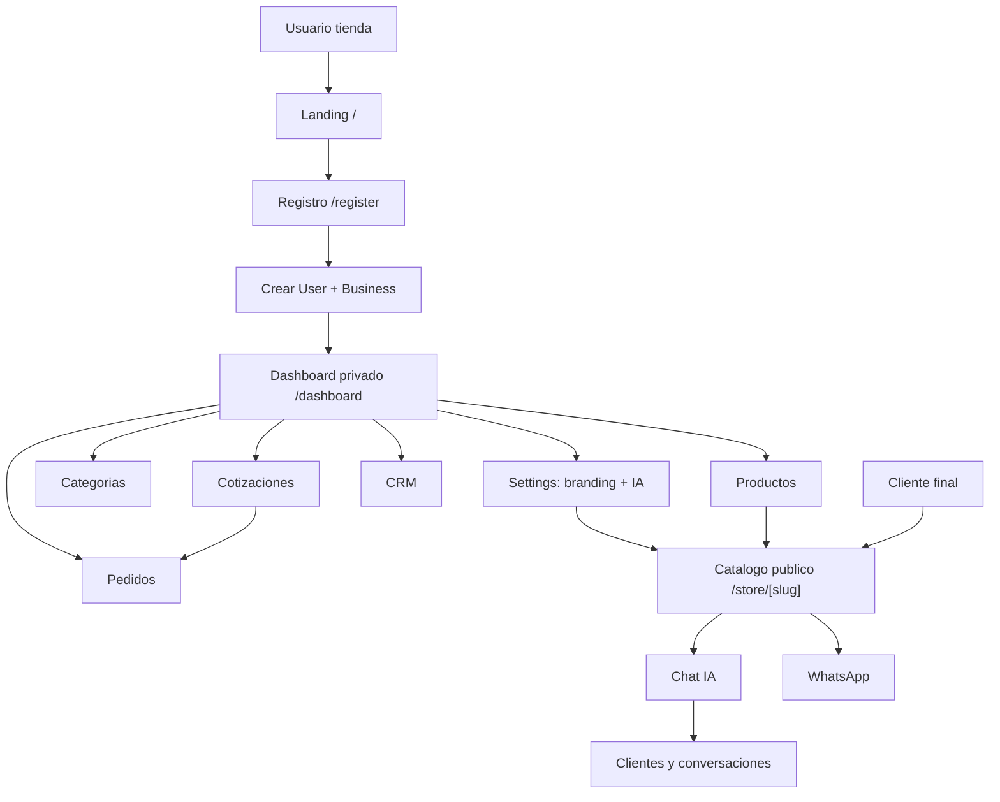

## 2. Flujo Multi-Tenant

**Archivo Mermaid**: [docs/diagrams/flujo-multitenant.mmd](diagrams/flujo-multitenant.mmd)
**SVG generado**: [flujo-multitenant.svg](diagrams/flujo-multitenant.svg)

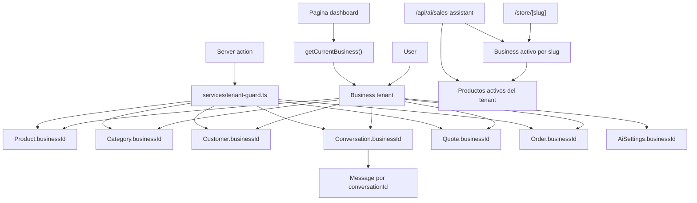

## 3. Flujo Catalogo Publico

**Archivo Mermaid**: [docs/diagrams/flujo-catalogo-publico.mmd](diagrams/flujo-catalogo-publico.mmd)
**SVG generado**: [flujo-catalogo-publico.svg](diagrams/flujo-catalogo-publico.svg)

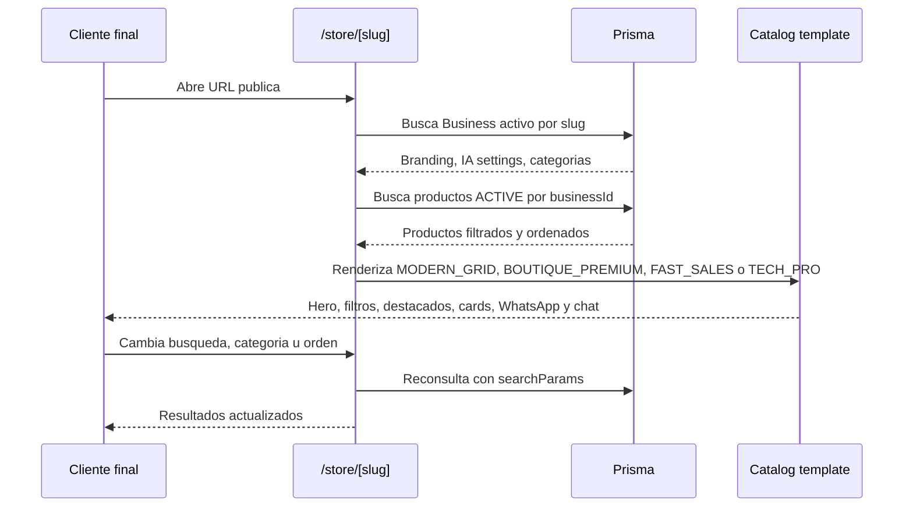

## 4. Flujo Chat IA

**Archivo Mermaid**: [docs/diagrams/flujo-chat-ia.mmd](diagrams/flujo-chat-ia.mmd)
**SVG generado**: [flujo-chat-ia.svg](diagrams/flujo-chat-ia.svg)

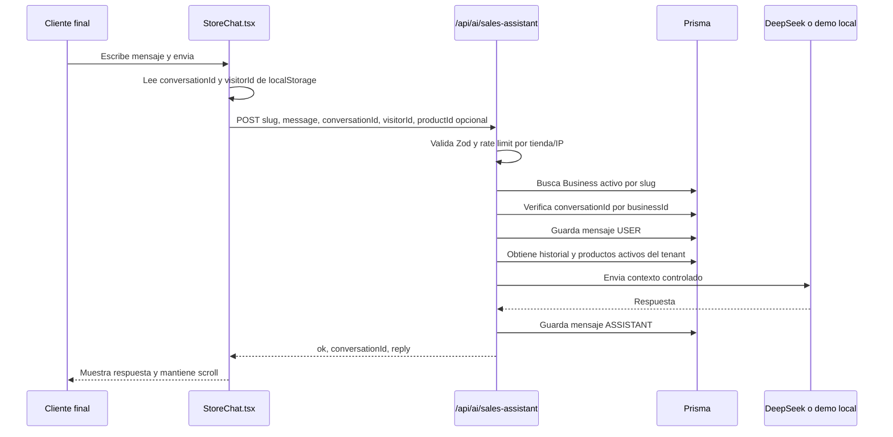

## 5. Flujo Boton Consultar IA

**Archivo Mermaid**: [docs/diagrams/flujo-consultar-ia.mmd](diagrams/flujo-consultar-ia.mmd)
**SVG generado**: [flujo-consultar-ia.svg](diagrams/flujo-consultar-ia.svg)

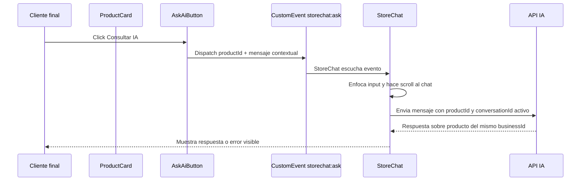

## 6. Flujo WhatsApp

**Archivo Mermaid**: [docs/diagrams/flujo-whatsapp.mmd](diagrams/flujo-whatsapp.mmd)
**SVG generado**: [flujo-whatsapp.svg](diagrams/flujo-whatsapp.svg)

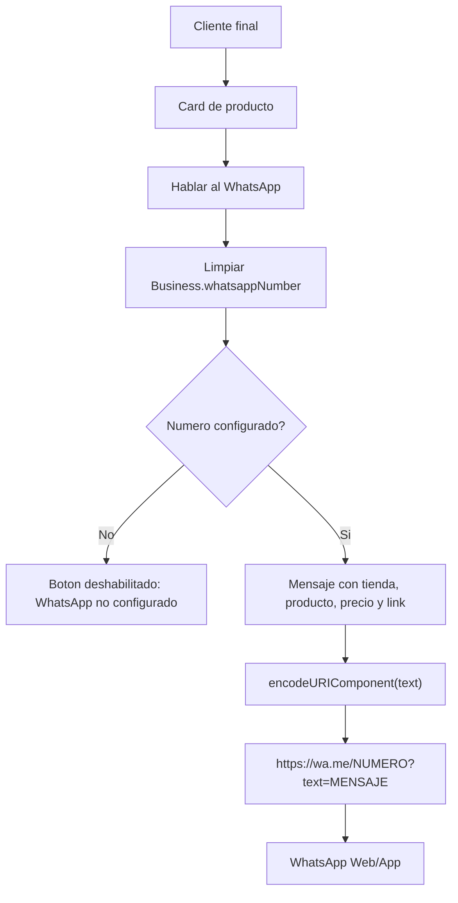

## 7. Flujo Upload Imagenes

**Archivo Mermaid**: [docs/diagrams/flujo-upload-imagenes.mmd](diagrams/flujo-upload-imagenes.mmd)
**SVG generado**: [flujo-upload-imagenes.svg](diagrams/flujo-upload-imagenes.svg)

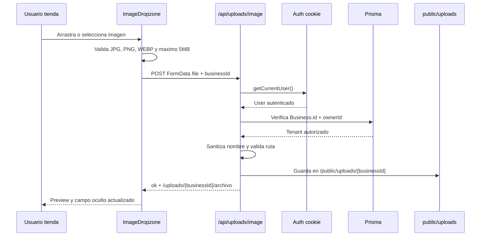

## 8. Flujo Productos

**Archivo Mermaid**: [docs/diagrams/flujo-productos.mmd](diagrams/flujo-productos.mmd)
**SVG generado**: [flujo-productos.svg](diagrams/flujo-productos.svg)

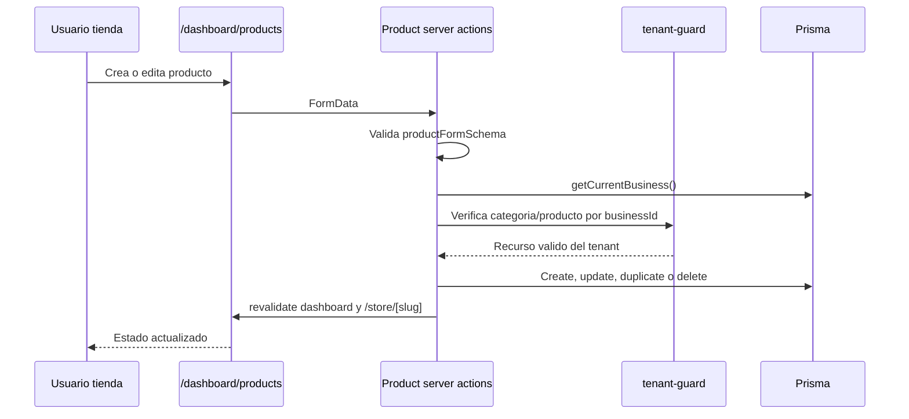

## 9. Flujo Cotizacion A Pedido

**Archivo Mermaid**: [docs/diagrams/flujo-cotizacion-pedido.mmd](diagrams/flujo-cotizacion-pedido.mmd)
**SVG generado**: [flujo-cotizacion-pedido.svg](diagrams/flujo-cotizacion-pedido.svg)

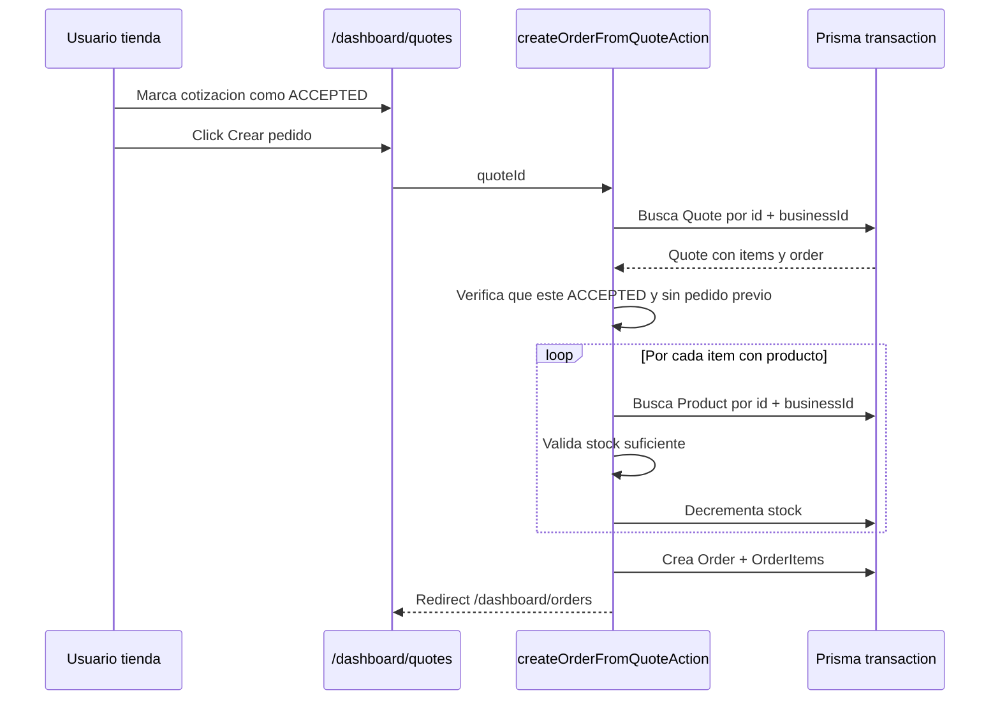

## 10. Flujo Superadmin

**Archivo Mermaid**: [docs/diagrams/flujo-superadmin.mmd](diagrams/flujo-superadmin.mmd)
**SVG generado**: [flujo-superadmin.svg](diagrams/flujo-superadmin.svg)

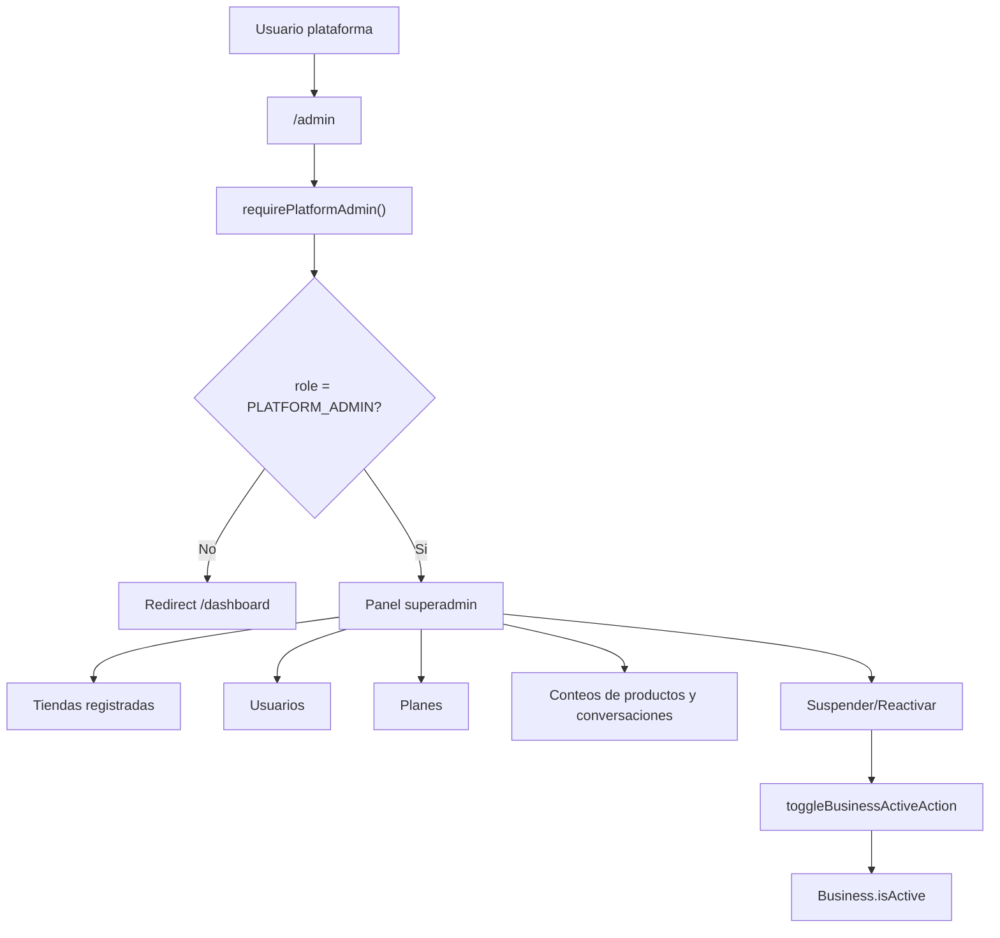
